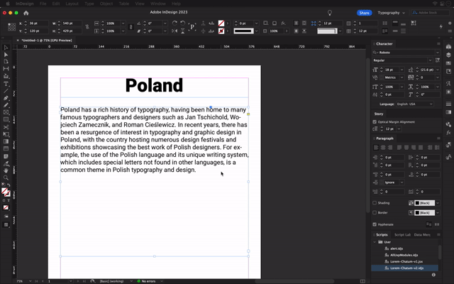

# _Lorem Chatum_ for Adobe InDesign

**Script for Adobe InDesign that uses ChatGPT to produce better _lorem ipsum_.** 

_Lorem Chatum_ is a script for Adobe InDesign that uses ChatGPT to generate multilingual, contextually relevant _lorem ipsum_ text. It has two functionalities: fill an empty text frame based on other texts on the page, or extend existing text within a selected frame. 

To use _Lorem Chatum_, you need your own [OpenAI API secret key](https://platform.openai.com/account/api-keys). The usage of the OpenAI API is paid, but it’s cheap. For example, Leo Tolstoy’s “War and Peace” is 1,200+ pages, 500k words, 3M+ characters. In OpenAI terms, it’s 780k tokens. Processing this book with OpenAI’s `gpt-3.5-turbo` model would cost you about US$3 (yes, just three U.S. dollars!) 

_As of March 2023, the GPT-4 model is much more expensive: it would cost US$900 to process the same book._

ChatGPT-4 has heavily assisted me in writing this code. 

## What ChatGPT says about this

### Taglines

Here’s a few ChatGPT-written taglines about this project: 

> “Unleash the Power of AI-Generated _Lorem Ipsum_ with _Lorem Chatum_ for Adobe InDesign!”
> 
> “Elevate Your InDesign Experience with Contextually Rich _Lorem Ipsum_ Text from _Lorem Chatum_!”
> 
> “Transform Your Design Process: Discover the AI-Enhanced _Lorem Ipsum_ Revolution with _Lorem Chatum_!”
> 
> “Lorem Chatum: Where Cutting-Edge AI Meets Adobe InDesign for Unparalleled _Lorem Ipsum_ Creativity!”

### Scenarios

Here’s a few usage scenarios, also written by ChatGPT: 

> Let’s say you’re working on a magazine layout with multiple articles on a single page. You’ve completed a few articles, but you still need to fill the remaining empty text frames with placeholder text that matches the style and language of the existing content. With _Lorem Chatum_, you can quickly generate contextually relevant _lorem ipsum_ text, making your layout design process more efficient and visually cohesive.
> 
> Or let’s say that you’re designing a multilingual brochure for a global event. You have text in various languages, and you need to create placeholder content that accurately reflects the characteristics of each language. _Lorem Chatum_ allows you to assign a specific language to each text frame, and then generate AI-powered _lorem ipsum_ text that matches the language and style of your actual content, making your design more professional and consistent.
> 
> Or imagine that you’re designing a book cover with a quote on the front. You have the beginning of the quote, but you need to extend it to fill the available space on the cover. Using _Lorem Chatum_, you can select the text frame containing the quote, and let the script generate an extended version of the quote that maintains its original style and language. This enables you to quickly create an engaging and visually appealing book cover design without manually searching for additional text.

## Caveat

The text that _Lorem Chatum_ generates is very authentic and believable. So if you’re working on a real publication and use _Lorem Chatum_ to generate placeholder text that you mix with real text, make sure you yourself keep track of what’s real text and what’s placeholder text! 

As with any AI-generated content, you shouldn’t trust _Lorem Chatum_ with generating ready-to-publish text. Make sure to review the generated text before sharing your publication with others. 

## Installation

### ➡️ [Download current versions of Lorem Chatum](https://github.com/twardoch/lorem-chatum-for-indesign/archive/refs/heads/main.zip)

Click the link above to download the current code, then unzip the downloaded `lorem-chatum-for-indesign-main.zip` and navigate into the unzipped folder. Then proceed depending on your InDesign version. 

### v2 for Adobe InDesign 2023 and newer 

> **Note:** Version 2 of _Lorem Chatum_ is licensed under the [Apache 2.0 License](src/v2-indesign-2023-and-newer/LICENSE.txt).

The [`src/v2-indesign-2023-and-newer/`](src/v2-indesign-2023-and-newer/) folder contains a version of _Lorem Chatum_ that uses the new UXP JavaScript scripting for Adobe InDesign 2023 and newer. This is the version that I plan to continue developing. 

#### Simple installation 

Go to [platform.openai.com/account/api-keys](https://platform.openai.com/account/api-keys) and generate a new OpenAI API secret key that starts with `sk-`. Copy the key to your clipboard. 

The folder also contains simple installers. Double-click the appropriate `install-` file for your platform (macOS or Windows) and when prompted, paste your OpenAI API key. (I tested the macOS installer, the Windows installer is untested.)

Once _Lorem Chatum_ is installed, start InDesign. Open **Window > Utilities > Scripts**. In the **Scripts** panel, expand the **User** section. The `Lorem-Chatum-v2.idjs` script should be there. 

#### Alternative installation 

Alternatively, open the `Lorem-Chatum-v2.idjs` script in a plain-text editor and put your OpenAI API key at the beginning of the script in the indicated place. Save the file, then put the modified script into the appropriate location where you have InDesign scripts.

### v1 Adobe InDesign 2022 and older

> **Note:** Version 1 of _Lorem Chatum_ is licensed under the [GNU General Public License v3.0](src/v1-indesign-2022-and-older/LICENSE.txt), due to a dependency.

The [`src/v1-indesign-2022-and-older`](src/v1-indesign-2022-and-older) folder contains version 1.0 of _Lorem Chatum_ that uses the old ExtendScript scripting for Adobe InDesign 2022 and older. I no longer plan to develop this version, but as of March 2023, it has largely the same functionality as version 2. 

#### Installation 

1. Go to [platform.openai.com/account/api-keys](https://platform.openai.com/account/api-keys) and generate a new OpenAI API secret key that starts with `sk-`. Copy the key to your clipboard. 
2. Open the `Lorem-Chatum-v1.jsx` script in a plain-text editor and put your OpenAI API key at the beginning of the script in the indicated place. Save the file. 
3. Put the modified script into the appropriate location where you have InDesign scripts.

## Usage

_Lorem Chatum_ in both editions has two functionalities: 

1. If you select an **empty text frame** and you run the script, ChatGPT will fill the frame with text, based on **other texts on the current page**. 
2. If you select a frame that **has some text** and you run the script, ChatGPT will make the existing text longer, but will disregard other texts on the page. 

You can repeat the process on the same frame. The approximate length of the text completion depends on the size of the text frame, and on its main font size. Set the main language of the text frame in the **Character** panel to choose the language in which ChatGPT will write the text. 

### _Lorem Chatum_ in an empty text frame

1. Make sure you have some text frames on your current page that have some text. 
2. Create an empty text frame (that has no text). 
3. Assign a language to the text frame in the **Character** panel. 
4. Select the frame with the **Selection Tool**. 
5. Double-click `Lorem-Chatum` (`-v2.idjs` or `-v1.jsx`) in the **Scripts** panel. 
6. The script gathers the text from the other text frames on the current page. 
7. The script sends that text to ChatGPT and asks it to complete the text in the language selected in the **Character** panel. The length of the text completion is estimated based on the size of the text frame. 
8. The script puts the result into the selected text frame. 

### _Lorem Chatum_ in a text frame that has text

1. Select a text frame that has some text with the **Selection Tool**.
2. Double-click `Lorem-Chatum` in the **Scripts** panel. 
3. The script sends that text to ChatGPT and asks it to complete the text in the language selected in the **Character** panel. The length of the text completion is estimated based on the size of the text frame. 
4. The script adds the result to the text of the selected frame. 
5. To get additional text, enlarge the text frame, and double-click the script again. 

## Contributing / Future

### v2 for Adobe InDesign 2023 and newer

Version 2 is written using modern ES6 and uses the [Adobe InDesign UXP](https://developer.adobe.com/indesign/uxp/) scripting API introduced in late 2022. ES6 has support for JSON and https API calls, so no polyfills were necessary. 

I’d like to continue working on this version, and contributions are welcome. Keep in mind that I’m not a proficient JS developer, so I cannot implement wishes you may have. But if you propose a pull request yourself, I may consider it. 

Some ideas for future work (in no particular order) include: 

- [ ] Turning the script into a plugin once InDesign supports UXP plugins.
- [ ] Improving the UI.
- [ ] Adding an easier ability to enter the OpenAI API key, which is then stored using the [Key-Value Storage](https://developer.adobe.com/xd/uxp/uxp/reference-js/Modules/uxp/Key-Value%20Storage/SecureStorage/) (this won’t work if the code is a script, but may work once the code becomes a plugin.)
- [ ] Adding more types of prompting.
- [ ] Improving the estimated token length.
- [ ] Adding a functionality of translation if two frames are selected: one empty (target) and one full (source).
- [ ] Adding a functionality to shorten/summarize the text to get rid of a frame overflow.

### v1 for Adobe InDesign 2022 and older

Version 1 is written in old ExtendScript, which cannot natively process JSON or make https API calls. 

The code includes “polyfills” for both functionalities. For simplicity of packaging, the polyfills are included directly into the script code. 

I consider this version “as is”, and “end-of-life”. I don’t plan to accept contributions to this version.

## Authors & License

- Copyright (c) 2023 Adam Twardoch.
- Version 1 of the code was written with significant assistance from ChatGPT-4.

### v2 for Adobe InDesign 2023 and newer

- Version 2 of _Lorem Chatum_ is licensed under the [Apache 2.0 License](src/v2-indesign-2023-and-newer/LICENSE.txt).

### v1 for Adobe InDesign 2022 and older

- Version 1 of _Lorem Chatum_ is licensed under the [GNU General Public License v3.0](src/v1-indesign-2022-and-older/LICENSE.txt), due to a dependency.
- For JSON processing, _Lorem Chatum_ v1 includes the [standalone JSON](https://github.com/indiscripts/extendscript/tree/master/JSON) code, copyright (c) 2017-2022 [Marc Autret](https://indiscripts.com/), licensed under the MIT license.  
- For https API calls, _Lorem Chatum_ v1 includes the [Restix](https://github.com/grefel/restix/blob/master/restix.jsx) code by [Gregor Fellenz](http://www.publishingx.de), licensed under the GNU General Public License v3.0. This makes the entire code GPL3.

